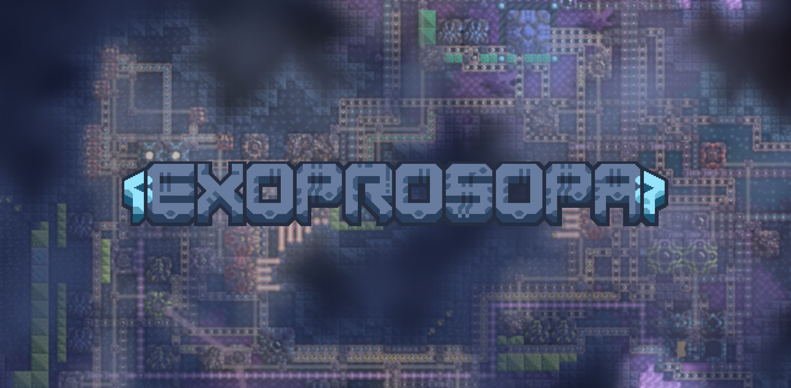

# Exoprosopa : Early Access

  

  Exoprosopa adds frostnova planet into the game alongside with its own unique techtree and environment.  
  Conquer this planet with over 18 campaign maps available on this mod. 
  Including challenge maps!  
  With over 13 items to be discovered, 124 blocks to be researched. and 17 different units to build! 
  Thankyou for playing this mod! 
  You can contributes maps or gives suggestions by join Exoprosopa Server! 
  Check it on my profile. My username is TnmSpiroct on discord.  
### Still in early access, expect some unfinished content.
